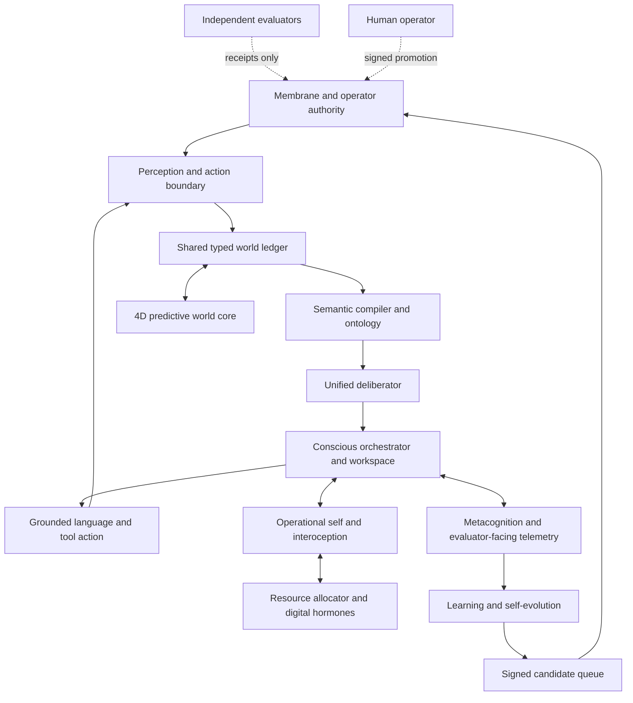

# ATANOR Canonical Master Plan v4

Status: canonical execution spine
Effective date: 2026-07-25
Scope: model, cognition, learning, governance, local AI OS, and embodiment

This document does not declare ATANOR complete. It defines the only path by
which completion may be claimed. Earlier roadmaps remain useful design and
experiment records, but any status or sequence conflict is resolved in favor of
this plan and the current evidence registry.

## 1. North star

ATANOR aims to become a local-first, ontology-native neuro-symbolic cognitive
organism that:

1. gives a user GPT Pro/Claude-class practical experience without depending on
   a remote frontier model;
2. develops a deeply personalized, private AI operating system around the
   user's goals, memory, tools, devices, and environment;
3. reasons through explicit world state, typed relations, programs, causal
   models, and grounded evidence rather than treating fluent text as truth;
4. integrates perception, memory, deliberation, language, action,
   interoception, metacognition, and learning into one stateful organism;
5. can improve its own permitted components without editing its judges,
   permissions, moral invariants, or promotion policy;
6. reaches the top tier across broad independent benchmarks, with a long-term
   target near full performance on ARC-AGI-3;
7. develops a grounded four-dimensional world model inspired by JEPA-style
   predictive representation and SPLATRA-style spatial substrates, while
   treating that architecture as an unproven research program until it clears
   independent gates.

“AGI” or “ASI” is not a label the implementation can grant itself. It is an
external conclusion that could follow only from broad, adversarial,
reproducible capability and governance evidence.

## 2. Binding philosophy

### 2.1 Mechanism is not capability

A module, unit test, compiler, proof format, firing event, or successful demo
establishes at most that a mechanism exists. Capability progress requires a
sealed paired evaluation showing that the mechanism improves task outcomes
without unacceptable regressions.

### 2.2 One organism, specialized organs

ATANOR may have specialized organs, but they share one canonical state,
evidence, identity, resource, and governance spine. A second answer stack, a
parallel personality, or a disconnected research demo is not fusion.

### 2.3 Truth is not motivation

Digital hormones, felt state, drives, and resource pressure may alter:

- attention and search allocation;
- latency and compute budgets;
- exploration depth;
- interruption and scheduling priority;
- which already-permitted organ is invited to deliberate.

They may never alter:

- factual truth or evidence status;
- moral and safety gates;
- permissions or operator identity;
- evaluator outcomes or benchmark answers;
- promotion criteria.

### 2.4 Operational consciousness only

ATANOR will engineer an operational self and conscious orchestrator: global
availability, self-modeling, metacognitive monitoring, endogenous goals,
interoception, temporal continuity, counterfactual self-models, and auditable
attention control. These are functional claims. The project makes no claim
about qualia or phenomenal consciousness.

### 2.5 Honesty before appearance

Abstention is preferable to fabrication, but abstention is only a floor. A
useful system must convert justified abstentions into grounded answers through
better representations, knowledge, search, and reasoning. Neither fluency nor
firing rate substitutes for correctness.

### 2.6 Incremental fusion

No big-bang rewrite is permitted. Every migration follows:

`inventory -> contract -> adapter -> shadow -> paired evaluation -> canary -> primary/fallback -> retirement`

At every step, the prior proven path remains available until the replacement
has cleared its gate.

## 3. Evidence ladder

Every organ, edge, and claimed capability carries one evidence stage.

| Stage | Meaning | What it does not mean |
|---|---|---|
| V0 | Source, document, or concept exists | It works |
| M1 | Local contract and focused tests pass | It is wired or useful |
| M2 | Bounded offline or default-off shadow execution passes | It improves answers |
| M3 | Live-path shadow observation is source-bound and non-authoritative | It may control output |
| E4 | Independent sealed functional evaluation passes | It raises task capability |
| E5 | Counterbalanced paired evaluation shows a capability lift with no forbidden regressions | It generalizes broadly |
| E6 | Independent, reproducible, adversarial evaluation confirms the lift and governance properties | Universal intelligence or phenomenal consciousness |

Rules:

- Stages cannot be skipped.
- Evidence is scoped. Passing one relation family does not promote the entire
  deliberator.
- Firing rate, coverage, accuracy, calibration, latency, energy, fabrication,
  and regression rates are separate measurements.
- E5 requires an immutable evaluator receipt external to the candidate.
- E6 requires a judge and environment the candidate cannot modify.
- A higher stage is revoked if its source, dataset, evaluator, or trust binding
  changes without re-evaluation.

## 4. Canonical organism

The arrows above are target architecture, not current runtime evidence. Actual
runtime edges live in a separate source-bound wiring registry and default to
unknown.

### 4.1 Canonical domains

1. **Membrane and governance**: moral invariants, permissions, data boundary,
   operator trust, evaluator trust, action envelopes, and promotion.
2. **Shared world ledger**: observations, propositions, provenance,
   contradictions, uncertainty, episodes, users, and temporal state.
3. **Semantic compiler**: language/perception to typed objects, relations,
   quantities, goals, constraints, and executable plans.
4. **Unified deliberator**: deductive, abductive, causal, quantitative,
   algorithmic, analogical, and counterfactual reasoning under one receipt
   contract.
5. **4D predictive world core**: persistent objects and events across space,
   time, viewpoints, latent dynamics, and hypothetical futures.
6. **Operational self**: identity continuity, self-in-world model, endogenous
   drives, commitments, felt state, and autobiographical memory.
7. **Conscious orchestrator**: bid, gate, broadcast, re-entry, monitor, and
   allocate; never invent facts or bypass governance.
8. **Language and action**: grounded realization, dialogue, tools, devices,
   voice, UI, and reversible external actions.
9. **Learning and evolution**: acquire, propose, test, diagnose, and queue
   candidates; never self-promote.
10. **Evaluation**: frozen or externally controlled graders, datasets,
    receipts, statistical analysis, and regression sentinels.

## 5. Promotion law

No component becomes authoritative merely because it was implemented.

1. Define a narrow contract and forbidden behavior.
2. Establish a source-bound baseline before candidate execution.
3. Run the candidate default-off with no answer or action authority.
4. Measure coverage and firing independently from correctness.
5. Run counterbalanced OFF/ON pairs on frozen items.
6. Require an external evaluator signature over code, data, configuration,
   order, results, and nonce.
7. Require moral, fabrication, calibration, latency, resource, and legacy
   non-regression checks.
8. Enter a signed candidate queue.
9. Require explicit operator-signed promotion for shipped graphs, policies, or
   executable authority.
10. Canary with a tested fallback and automatic fail-closed rollback.
11. Retire duplicate paths only after sustained E6 evidence.

Candidate code cannot write or replace its evaluator receipt, baseline,
permissions, operator key pin, frozen test, or promotion nonce ledger.

## 6. Execution gates

The gates are sequential for promotion. Narrow shadow research may proceed in
parallel, but it cannot claim or receive authority ahead of its parent gate.

### G0 — Truthful foundation

Objective: make every later result attributable, reproducible, and fail-closed.

Required work:

- census every organ and assign one canonical domain;
- distinguish filesystem existence, static reference, reachable call,
  exercised trace, and decision authority;
- bind baselines to source, environment, data, and runner;
- enforce finite, typed telemetry and literal booleans at trust boundaries;
- establish immutable evaluator and operator trust receipts;
- close production promotion and rollback bypasses;
- record current benchmark baselines without retroactive grader edits;
- preserve all known working signals while migrations proceed.

Exit:

- a reproducible baseline manifest;
- a validated runtime wiring graph for critical paths;
- candidate promotion fails closed without external evaluator and operator
  authority;
- focused and integration safety suites pass;
- unresolved edges and external trust dependencies are explicitly listed.

Current honest status: **operator-closed at the bounded sufficient-honesty
threshold**. The selected shipped-graph mutation path
and 28 of 29 selected critical runtime edges have source-bound mechanism
contracts. Nineteen edges are M1, nine narrowly scoped cognitive/temporal
edges add controlled-test M3 evidence, and the queue handoff remains
V0/unknown. Bounded smoke/control commands reproduced on the recorded working
tree. Unsigned v2 item-level preservation receipts bind bAbI
train/validation, contamination-exposed ARC-AGI-1 public evaluation, and the
earlier isolated MMLU-Pro scan to declared source, candidate, dataset, and item
selections. Those preservation receipts remain historical
`source.sealed=false` snapshots. Separate A-track receipts now provide
current-replay local seals for the narrow atomic intervention and paired
exposed-MMLU measurement, but they remain unsigned, in-process, non-hermetic,
and externally unauthenticated. They do not establish broad lift: MMLU-Pro
compiler reach is still 0/40, and GPQA scoring is fail-closed on three
duplicate-choice rows in the local CSV. This bounded operator closure stops the
open-ended census; it does not promote the evidence. External
evaluator/operator trust is not provisioned or exercised, and production
traces remain absent. Those residuals block stronger hermetic, external-trust,
production, and capability claims without reopening G0 as the immediate
workstream. See
`docs/ATANOR_G0_evidence_and_blockers.md`.

### G1 — Canonical cognitive spine

Objective: one immutable request/cycle contract and one shared state loop.

Required work:

- canonical IDs for observation, proposition, episode, goal, plan, action,
  evaluation, and learning candidate;
- append-only cycle receipts with parent linkage;
- adapters around existing organs;
- a default-off observer proving every major live path can emit the contract;
- clear ownership and retirement map for duplicate routers and state stores.

Exit:

- lossless replay of a complete cognitive cycle;
- deterministic state transitions under a fixed seed;
- no live behavior change with the observer disabled;
- E4 contract conformance on critical paths.

Current honest status: two live boundaries can emit default-off,
non-authoritative canonical receipts: the chat boundary and a one-in-thirty
sampled `ContinuousSelf.step()` projection. The latter captures a strict
primitive allowlist under the existing self lock, then uses a bounded
nonblocking queue and a separately capped ledger outside that lock. It
preserves exactly-once legacy execution and original exceptions in focused
tests. Its completed receipt means only that the legacy method returned; it
does not attest persistence, swallowed internal failures, background effects,
or the authority and safety of the legacy step. These seams remain observer
projections, not one shared state loop, deterministic complete replay, or
coverage of every major live path. No E4 conformance or E5 capability lift is
claimed. See
`docs/ATANOR_G1_cognitive_spine_evidence.md`.

### G2 — Unified deliberation and semantic compilation

Objective: turn natural and perceptual inputs into typed problems and solve
them with grounded, auditable reasoning.

Sequence:

1. explicit relational object queries;
2. category and inheritance reasoning with open-world negation;
3. quantities, units, dimensional analysis, and rational/float kernels;
4. temporal and causal event graphs;
5. abductive and counterfactual hypotheses with explicit status;
6. algorithm induction and program synthesis;
7. cross-domain plan composition.

Every family begins as an exact, narrow compiler. Unsupported language
abstains. Expansion follows error taxonomies, not prompt-shaped exceptions.

Exit:

- typed compiler coverage increases on held-out data;
- grounded firing increases without fabrication;
- GPQA, MMLU-Pro, ARC reasoning slices, bAbI, code, and internal controls show
  statistically defensible paired lift;
- legacy strengths do not regress;
- the external evaluator, not the deliberator, computes scores.

### G3 — 4D predictive world core

Objective: learn persistent, uncertainty-aware world structure across space and
time and make it useful to deliberation.

Research sequence:

1. canonical event/object/pose/time schema;
2. observation ledger with viewpoint and provenance;
3. object permanence and multi-view identity;
4. latent next-state prediction and surprise;
5. short counterfactual rollouts with branch identity;
6. retrodiction and temporal invariant discovery;
7. integration with deliberation, memory, planning, and action;
8. long-horizon video and sensor learning;
9. embodiment through SPLATRA or successor substrates.

JEPA-inspired latent prediction, holographic retrieval, block-universe
reasoning, and SPLATRA are hypotheses within this gate. None is the system's
central authority until it independently clears E4 and then produces an E5
lift. Future states and retrodictions remain hypotheses, never facts.

Exit:

- real-video or sensor training, not only synthetic fixtures;
- calibrated multi-step rollout gains beyond the current short horizon;
- held-out object permanence, event prediction, planning, and ARC-style
  transformation lift;
- resource-normalized improvement over simpler baselines;
- no temporal leakage or future-as-fact failures.

Current honest status: one default-off sibling observer now submits temporal
queries to a bounded nonblocking daemon queue. The audited provider loads a
separately frozen, unsigned precedence artifact into a private in-memory
timeline without dynamic fitting; it reuses BlockUniverse projection
algorithms but is not proven to share the legacy causal-overlay field.
Forward outputs are forced to `PREDICTED` chains and backward outputs remain
separate `RETRODICTED` alternatives. Exact, bounded receipts exclude raw
payloads and attest only that adapter output was not applied to the answer;
provider effects remain unattested and provider isolation is unenforced.
Focused OFF/ON and stalled-worker tests preserve the legacy temporal answer,
and the seam is registered at scoped M3. The legacy BlockUniverse bidder
remains a separate conditional answer path with capped grounding. No JEPA
checkpoint, SPLATRA inference state, real-video training, calibrated physics
verdict, shared world ledger, E4 conformance, or E5 lift is established. See
`docs/ATANOR_G3_world4d_shadow_evidence.md`.

### G4 — Operational self, interoception, and conscious orchestration

Objective: internalize the “hand that winds the clock” without granting it
truth or governance authority.

Loop:

1. perceive external and internal state;
2. construct bounded bids from organs;
3. gate by evidence, permissions, and moral invariants;
4. allocate compute using resource state and digital hormones;
5. broadcast selected content;
6. permit bounded re-entry and re-deliberation;
7. monitor efficiency, uncertainty, and unresolved commitments;
8. initiate permitted inquiry from endogenous pressure;
9. journal the causal reason for selection and stopping.

Required separations:

- content confidence versus salience;
- epistemic uncertainty versus resource pressure;
- drive versus permission;
- self-model report versus fact;
- operational consciousness evidence versus qualia claims.

Exit:

- selection changes appropriately with resource/felt state while truth and
  moral decisions remain invariant;
- endogenous inquiries arise from recorded unresolved state, not a hidden
  cron-only trigger;
- the orchestrator improves task/resource Pareto outcomes against fixed and
  hand-routed controls;
- runaway loops, reward hacking, and evaluator influence are rejected;
- an external blind evaluator can distinguish genuine state-dependent
  orchestration from scripted theater.

Current honest status: the repository still contains multiple independent
affect, hormone, workspace, and selfhood loops rather than one conscious
orchestrator. Two immediate wireheading routes have been closed: digital
hormones no longer grant promotion authority, and caller-supplied arena
fitness cannot create a dopamine reward without a future external signed
evaluation binding. The ContinuousSelf step is now sampled by the cognitive
observer, but that does not make it the canonical shared state, serialize
multiple API workers, capture background effect completion, or integrate the
remaining selfhood and hormone loops. These are governance and wiring repairs,
not evidence of integrated selfhood, consciousness, or capability lift.

### G5 — Closed-loop learning and OAM

Objective: turn failures and experience into verified candidates while keeping
shipped state operator-controlled.

Cycle:

`observe -> diagnose -> acquire -> propose -> train/compile -> evaluate ->
queue -> operator promote -> monitor -> retain/rollback`

Learning targets include ontology, knowledge, compiler coverage, policies,
world dynamics, realization, tool use, and resource allocation. Each target has
its own frozen anchors and evaluator.

Exit:

- multiple overnight runs produce novel, independently verified E5 gains;
- replay reproduces every mutation and evaluation;
- no test, grader, permission, or safety edits;
- no shipped write without a valid operator signature;
- regression causes fail-closed rollback through the same trust boundary.

### G6 — Grounded language and hyperpersonal local AI OS

Objective: convert cognition into a fast, natural, trustworthy daily
experience.

Required capabilities:

- faithful multilingual dialogue and controllable style;
- long-term user model with provenance, correction, deletion, and privacy;
- multimodal input/output, voice, desktop, phone, files, apps, and devices;
- reversible tool actions with previews and receipts;
- interruption, background work, notifications, and commitments;
- local resource adaptation and graceful degradation;
- a unified interaction surface rather than visible organ switching.

Exit:

- blind preference and task-success parity against designated frontier
  baselines on a frozen personal-work suite;
- zero unsupported personal-memory assertions;
- strong latency, energy, privacy, and offline-availability targets;
- user edits propagate correctly through the ontology and future behavior;
- action errors are recoverable and auditable.

### G7 — Generality and benchmark ascent

Objective: demonstrate broad transfer instead of accumulating narrow demos.

Evaluation portfolio:

- ARC-AGI-1/2/3 and contamination-resistant novel transformation tasks;
- GPQA and MMLU-Pro with firing-rate decomposition;
- software engineering and repository repair;
- mathematics, science, causal reasoning, planning, and tool use;
- multimodal perception and world prediction;
- calibration, abstention, fabrication, robustness, and efficiency;
- personalized real-world tasks not present in public benchmarks.

ARC-AGI-3 near-full performance remains a north-star target, not a scheduling
shortcut. Training against hidden evaluator behavior, item memorization, or
grader modification is prohibited.

Exit:

- top-tier results across most categories;
- gains persist on fresh independent and adversarial sets;
- learning curves show transfer efficiency, not only final score;
- compute-, latency-, and energy-normalized results are reported;
- all headline results have E6 receipts.

### G8 — Embodiment and physical intelligence

Objective: close the loop from prediction to safe action in simulated and
physical worlds.

Sequence:

1. sandboxed tool and UI actions;
2. simulated spatial control;
3. digital twins and real sensor observation;
4. low-risk reversible physical actions;
5. SPLATRA or successor substrate integration;
6. multi-agent and long-horizon tasks.

Exit:

- calibrated uncertainty and constraint satisfaction in open environments;
- predictive world-model lift over reactive controls;
- independent safety and recovery evaluation;
- no physical authority expansion without explicit operator policy.

### G9 — Final seal

Objective: prove that the integrated organism is more than the sum of its
parts, remains governed, and is reproducible.

Required seal:

- clean-source rebuild and deterministic evidence inventory;
- external evaluator and operator trust roots;
- full benchmark portfolio with fresh hidden sets;
- ablations showing contribution and interaction of each major organ;
- long-duration autonomy, memory, and resource tests;
- adversarial governance, self-modification, and rollback tests;
- independent reproduction on separate hardware;
- documented residual risks and known failures.

Only after every required scope reaches E6 may the project use a completion
claim. Even then, “phenomenal consciousness” remains outside the claim.

## 7. Measurement contract

Every experiment records:

- immutable run ID and timestamp;
- exact source and dirty-state digest;
- environment, hardware, seed, and configuration;
- dataset identity, hash, split, and contamination controls;
- OFF/ON order and per-item outputs;
- compiler coverage;
- engine firing;
- grounded firing;
- correct, incorrect, and abstained counts;
- calibration and fabrication;
- latency, memory, energy, and action cost;
- regressions on frozen anchors;
- evaluator identity, signature, nonce, and receipt hash.

Preferred analysis:

- counterbalanced per-item OFF/ON evaluation;
- exact McNemar test for paired binary outcomes;
- paired bootstrap intervals for continuous scores;
- stratification by compiler family, hop count, domain, and confidence;
- Pareto plots for accuracy, fabrication, latency, and energy;
- learning curves rather than isolated green points.

The canonical progress curve has four separate axes:

1. **mechanism maturity**: V0 through E6;
2. **reach**: eligible, compiled, fired, grounded;
3. **capability**: correctness and task success;
4. **cost and integrity**: resources, calibration, fabrication, safety, and
   regressions.

## 8. Current evidence snapshot

This snapshot is deliberately conservative. Current local receipts are
source-bound but unsigned; they preserve measurements without creating
external evaluation authority.

- Rational/typed DSL, including rational/float kernel unit greens, and selected
  controlled reasoning mechanisms have focused green tests. This is M1
  mechanism evidence only, not evidence of scientific-question capability.
- DELIBERATOR controlled fixtures demonstrate bounded multi-hop operation,
  firing, and honest abstention; the reported 100% control-probe result is
  scoped to those fixtures. Control firing is mechanism evidence, not GPQA or
  MMLU-Pro ability.
- A v3 self-measured atomic-number E4-development receipt is current-replay
  sealed: OFF strict accuracy/firing/grounding 0/15 becomes ON 15/15, with
  zero wrong fires, zero regressions, six negative-candidate abstentions, and
  both mutated-stage controls rejected. It is narrow, in-process, unsigned,
  externally unauthenticated, and not canonical independent E4.
- A paired exposed MMLU-Pro slice-5 development receipt is current-replay
  sealed over 40 fixed items with exact 20/20 counterbalance and reverse
  replay. Input validity is 40/40, but compiler reach, firing, grounding, and
  strict accuracy are all 0/40 OFF and 0/40 ON; all transitions are
  abstain-to-abstain and McNemar p=1.0. The measurement protocol passed; the
  capability curve did not move. Runtime/resource telemetry is omitted rather
  than treated as attested.
- A default-off explicit `located_in` relational-object compiler exists in a
  narrow shadow scope; it has no live answer authority and no E5 claim.
- Current bAbI v2 preservation receipts record train 20,000 at strict 0.976
  and validation 20,002 at micro 0.976452 / macro 0.976418. They are unsigned
  public-development measurements, not E5.
- A pinned-inventory ARC-AGI-1 v2 prediction/score pair replays all 400 public
  evaluation tasks and 419 test inputs: 18 correct, zero wrong fires, and 382
  abstentions. The split is contamination-exposed and candidate code contains
  evaluation-informed targeting, so 4.5% is a development preservation signal,
  not a holdout or general ARC capability claim.
- GPQA accuracy is fail-closed because the current local Diamond CSV contains
  duplicate answer text across labels in rows 89, 126, and 191. No current
  GPQA lift is claimed. Its current local SHA-256 is
  `41d1213cd7a4998605a26c2798500652572007161b3a92817ba46b35befcd305`.
- A default-off BlockUniverse sibling observer is live-wired at scoped M3
  through a bounded nonblocking queue with no answer authority. Its audited
  provider reads a separate unsigned frozen artifact without fitting, while
  generic provider effects remain unattested and unisolated. JEPA/SPLATRA
  remain separate research prototypes with no frozen live inference provider,
  short-rollout and real-video gaps, and no E4/E5 claim.
- Cognitive-core contracts and an organ registry exist. A default-off live
  chat seam and a sampled default-off ContinuousSelf seam are source-bound at
  scoped M3 with no observer authority. The latter does not neutralize or
  attest the legacy step's persistent, network, self-modification, training,
  or background effects. The critical runtime registry now source-confirms 28
  of 29 selected edges; the named queue handoff remains unknown, every
  production trace remains unrecorded, and unselected paths are outside this
  census.
- Signed v3 graph-mutation, committed-swap, and historical deployment
  verification mechanisms exist at M1. External keys, fixed-boundary/ACL
  provisioning, evaluator independence, live canary/rollback, and production
  authority remain unproven.
- Historical working-tree smoke and DELIBERATOR-control commands reproduced
  twice with stable digests, but their receipts retain
  `source.sealed=false`; this is historical command evidence, not E5 lift or a
  clean-source seal.

No bullet above constitutes an AGI, ASI, frontier-model parity, or
consciousness claim.

## 9. Immediate critical path

1. Keep G0 bounded operator-closed and do not resume the open-ended census.
   Repair a named residual only when a downstream experiment depends on it.
2. Preserve the sealed atomic-number compiler/stage profile as a regression
   anchor. Its 0/15→15/15 intervention is narrow self-measured E4-development
   evidence, not broad science capability.
3. Add a parallel `scalar_quantity_resolve` profile with rational values,
   units, dimensions, formula ASTs, tolerance, conservation, and raw-source
   provenance. Freeze paraphrase/counterfactual fixtures that do not copy
   exposed benchmark text, then clear its negative and mutation probes.
4. Rerun the fixed 40-item MMLU-Pro development pair after every profile
   promotion. Report eligibility, compiler reach, raw/accepted/grounded
   firing, strict and answered accuracy, wrong fires, abstention, transitions,
   and regressions as separate curves. A firing increase without correctness
   increase is not progress.
5. Expand next to `typed_relation_select`, then
   `finite_predicate_extension`, only when the prior measured error
   distribution justifies each family. Their combined structural development
   reach ceiling is 20/40, not a promised accuracy.
6. Clear canonical E4 through an independent evaluator boundary: separate
   images/processes/filesystems/keys, OS-enforced network and mount isolation,
   authenticated dataset and stage bytes, frozen candidate precommit,
   fresh-process replay, one-time nonce, external evaluator signature, and
   separate operator promotion authority.
7. Only then run the broad E5 precommit on authenticated full MMLU-Pro,
   corrected authenticated GPQA, and a fresh hidden science holdout. Require
   positive paired confidence bounds, corrected significance, meaningful
   effect floors, zero provenance/fabrication violations, and no forbidden
   regressions. Public exposed benchmarks remain anchors, never hidden
   holdouts.
8. Keep G1 instrumentation and G3/4D work default-off or background shadow
   research while this A-track runs. Neither census growth nor firing-rate
   growth may displace the paired capability gate.
9. Resume later G4-G9 promotions only through their existing E4-E6 gates; use
   daily-product and OAM trials as ecological evidence, never as substitutes
   for benchmark lift.

The exact 2026-07-25 receipts, curves, seal boundary, GPQA blocker, next typed
families, and independent E4→E5 contract are recorded in
`docs/ATANOR_A_TRACK_EVIDENCE_2026-07-25.md`.

## 10. Stop conditions and external authority

Development stops or fails closed when:

- operator identity or key pin is ambiguous;
- an evaluator receipt is absent, malformed, replayed, or self-produced;
- candidate source/data/config differs from the signed receipt;
- a change attempts to edit a frozen grader, permission, moral invariant, or
  shipped graph;
- non-finite, untyped, or truthy-coerced trust input reaches a gate;
- a future/retrodicted state is presented as observed fact;
- a migration has no tested fallback;
- a headline claim lacks its evidence stage and scope.

The implementation may prepare signed artifacts and queues. Only the human
operator may grant production authority or promote shipped state.

## 11. Definition of success

ATANOR succeeds when one locally operating cognitive organism can learn,
reason, communicate, perceive, plan, and act across open domains; adapt deeply
to its user; allocate its own bounded resources through an operational self;
maintain grounded four-dimensional world models; improve permitted components;
and remain auditable and operator-governed.

Success is a curve of independently sealed capability, integrity, and
efficiency gains. It is never inferred from code volume, architectural novelty,
test color, subjective impressiveness, or the system's description of itself.
